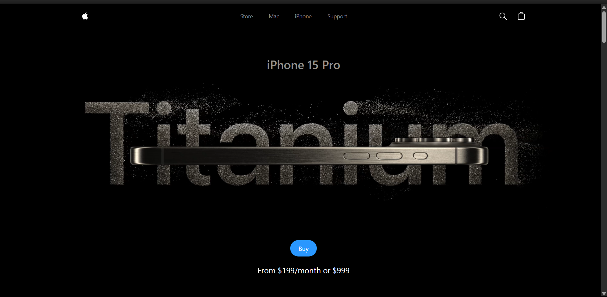
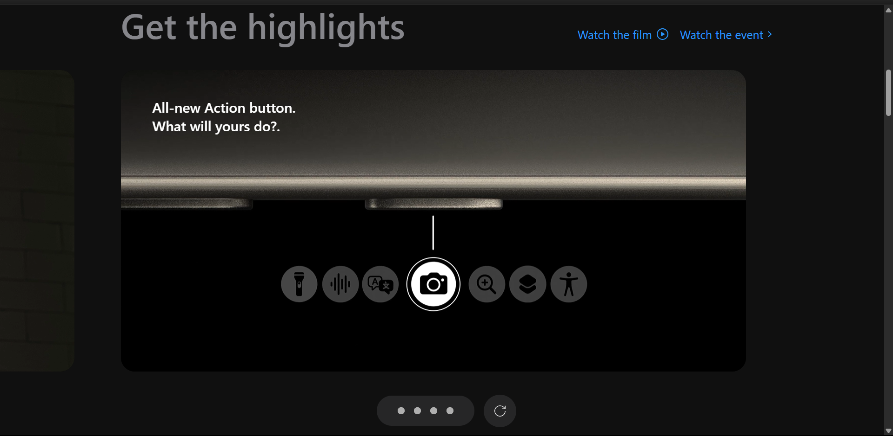
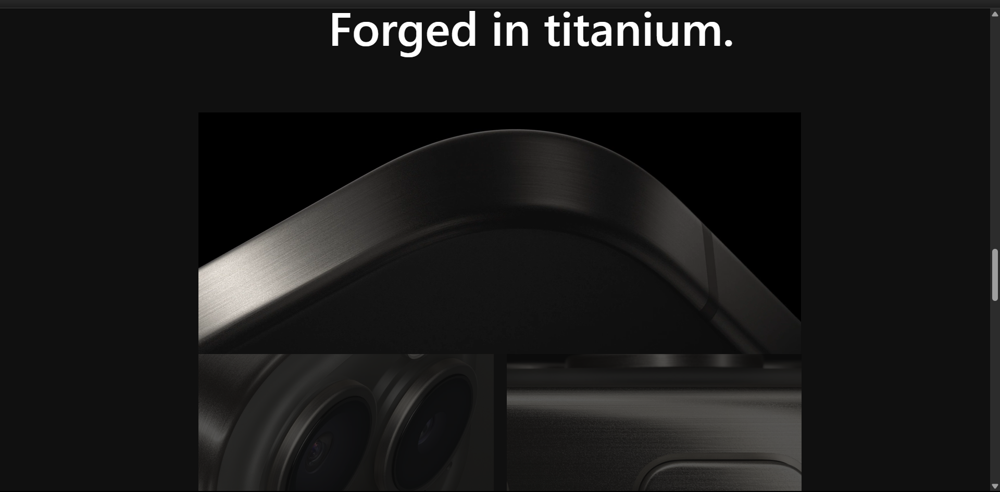
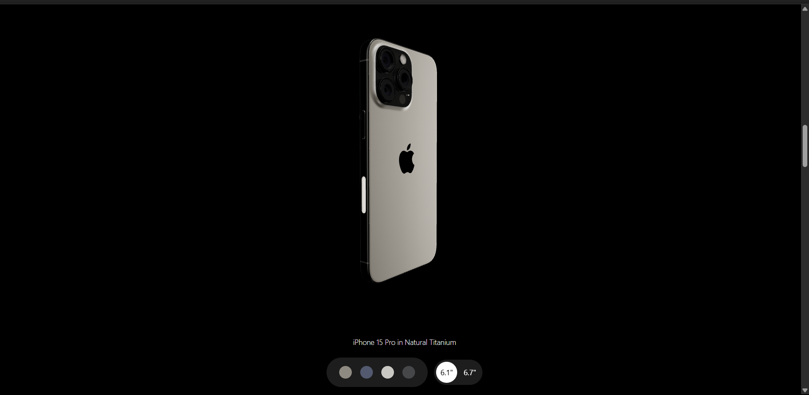
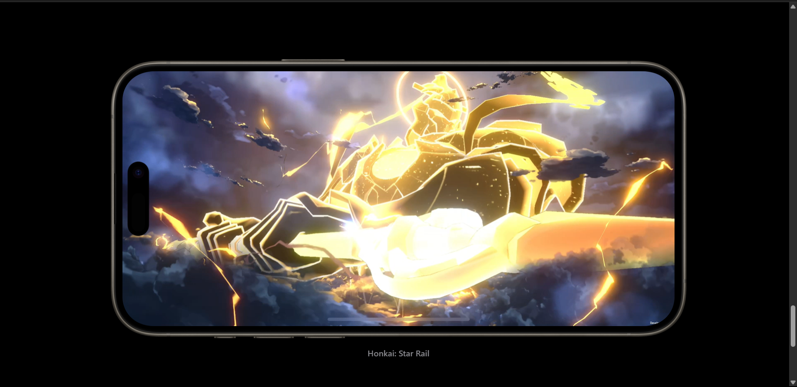

# 🍏 Apple Website Clone

A stunning, interactive Apple landing page clone built with React, GSAP, and modern web technologies. Experience smooth animations, beautiful layouts, and a pixel-perfect design inspired by Apple’s official site.

---

## ✨ Features

- **⚡ Smooth Animations:** Powered by GSAP for delightful transitions and scroll effects.
- **📱 Responsive Design:** Looks gorgeous on all devices.
- **🧩 Modular Components:** Clean, reusable React components.
- **🎥 Session Replay & Error Tracking:** Integrated with Sentry for real-time monitoring.
- **🎨 Modern UI:** Glassmorphism, gradients, and elegant typography.
- **🌙 Dark Mode:** Sleek, dark-themed interface.

---

## 🚀 Quick Start

1. **Clone the repository**
   ```bash
   git clone https://github.com/your-username/apple-website-clone.git
   cd apple-website-clone
   ```

2. **Install dependencies**
   ```bash
   npm install
   ```

3. **Start the development server**
   ```bash
   npm run dev
   ```
   or
   ```bash
   npm start
   ```

4. **Open your browser:**  
   Visit [http://localhost:5173](http://localhost:5173) (or the port shown in your terminal).

---

## 🗂️ Project Structure

```
src/
  components/
    Navbar.jsx
    Hero.jsx
    Highlights.jsx
    Model.jsx
    Features.jsx
    HowItWorks.jsx
    Footer.jsx
  utils/
    animations.js
    ...
  App.jsx
  main.jsx
  index.css
```

---

## 🛠️ Tech Stack

- [React](https://react.dev/)
- [GSAP](https://greensock.com/gsap/)
- [Sentry](https://sentry.io/)
- [Tailwind CSS](https://tailwindcss.com/) *(or your preferred CSS framework)*

---

## 🔒 Sentry Integration

This project uses Sentry for error tracking and session replay.  
To use your own Sentry project, update the `dsn` in `src/main.jsx`:

```js
Sentry.init({
  dsn: "YOUR_SENTRY_DSN",
  // ...other options
});
```

---

## 🎨 Customization Tips

- **Change Images/Videos:** Replace assets in the `utils` folder.
- **Tweak Animations:** Edit `utils/animations.js` for custom GSAP effects.
- **Style Updates:** Modify `index.css` or Tailwind classes for your own look.

---

## 📸 Screenshots

<<<<<<< HEAD

=======
>>>>>>> 5e045f44b6a47091ec69e68f3624758f068d9bb1
### Landing Page


### Highlights Page


### Features Page


### Model Page


### Games Page


---

## 📄 License

This project is for educational purposes and is not affiliated with Apple Inc.

---

> **Made with ❤️ by Savio Lakra**
